<p align="center">
    <a href="https://github.com/yiisoft" target="_blank">
        
    </a>
    <h1 align="center">Yii2 - Modern Starter Kit</h1>
    <br>
</p>

Yii2 - Modern Starter Kit is a modern, full-featured [Yii 2](https://www.yiiframework.com/) application template with React frontend powered by Inertia.js.

The template includes a beautiful UI built with Shadcn UI components, dark/light theme support, user authentication, CRUD operations, and all the modern features you need to rapidly build web applications.

## Screenshots

### Light Theme

<div align="center">

#### Home Page
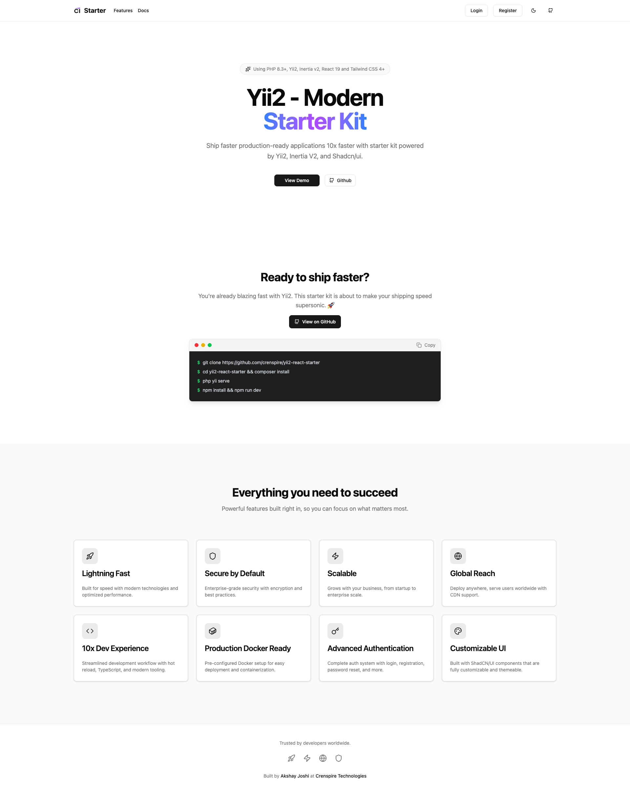

#### Sign In
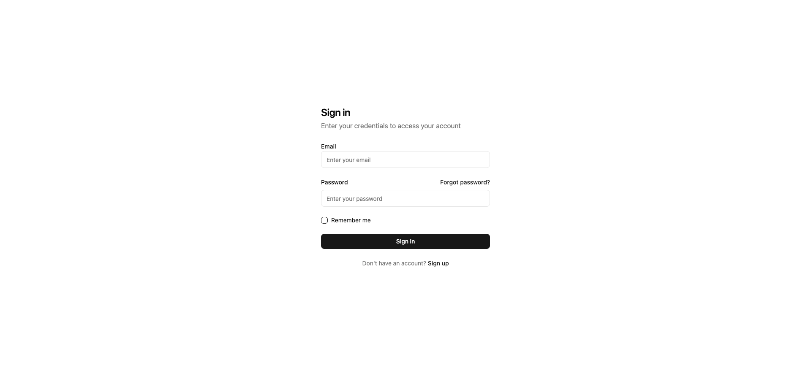

#### Sign Up
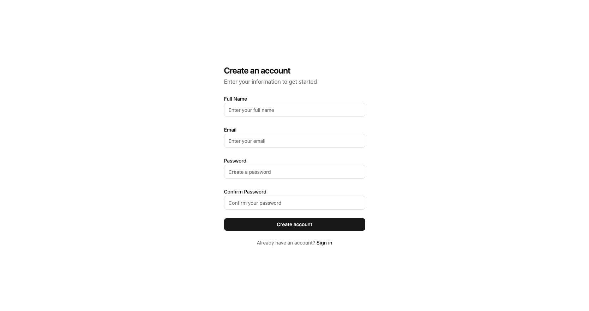

#### Dashboard
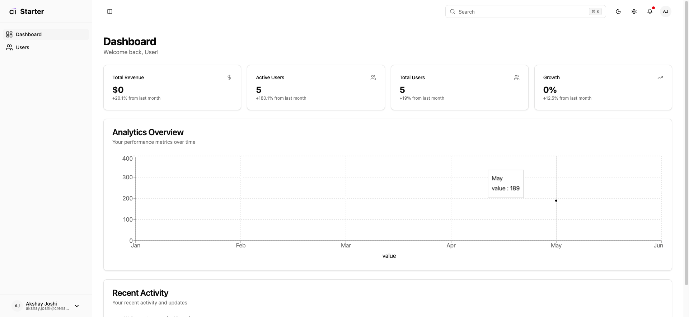

#### Users Management
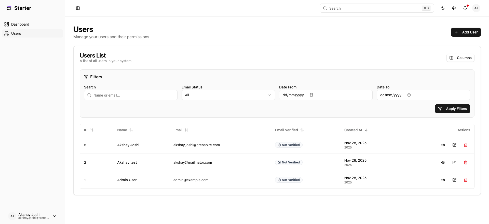

#### Settings
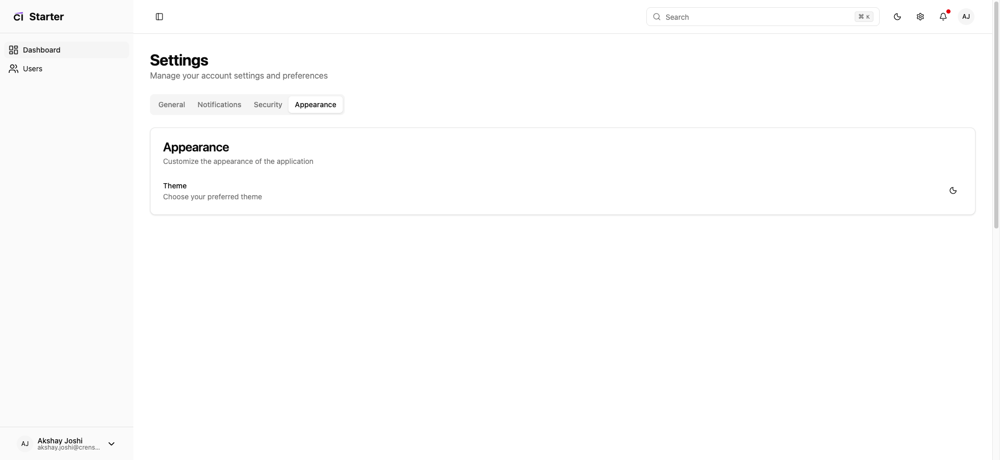

#### Forgot Password
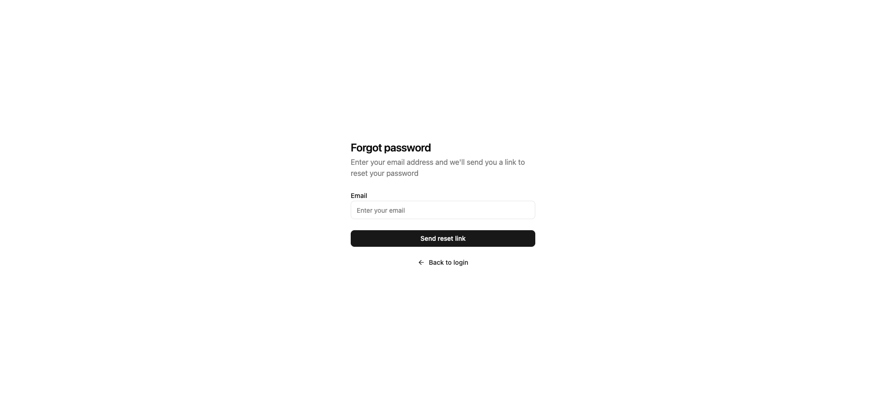

</div>

### Dark Theme

<div align="center">

#### Home Page


#### Sign In
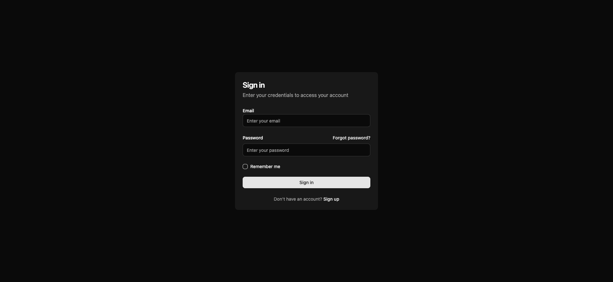

#### Sign Up
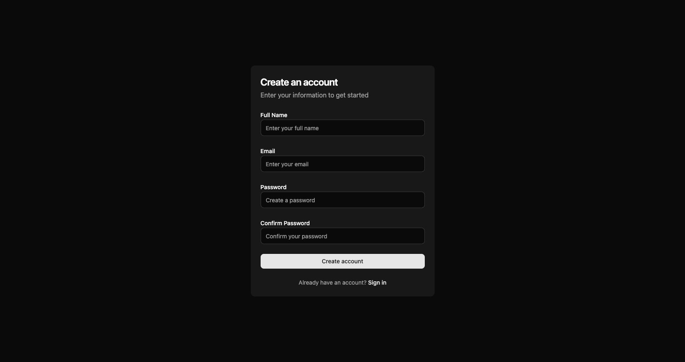

#### Dashboard
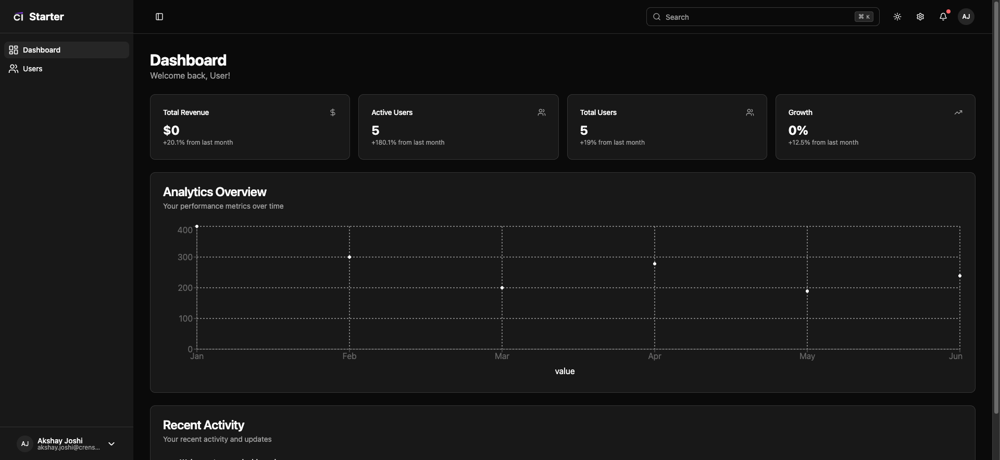

#### Users Management
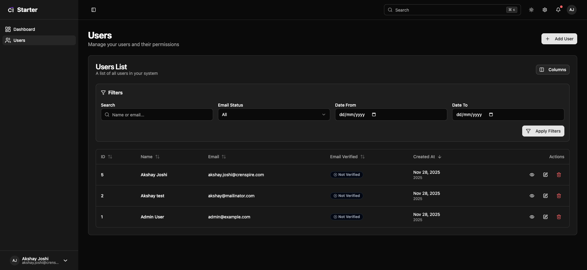

#### Settings
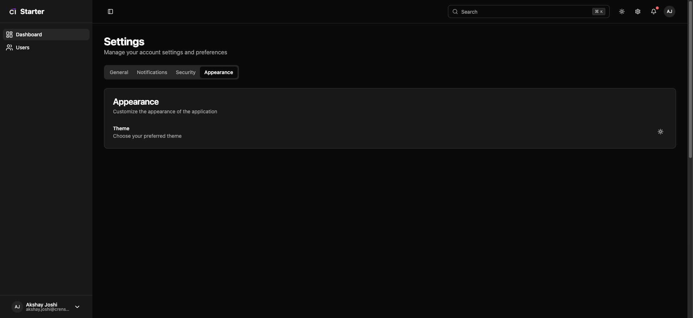

#### Forgot Password
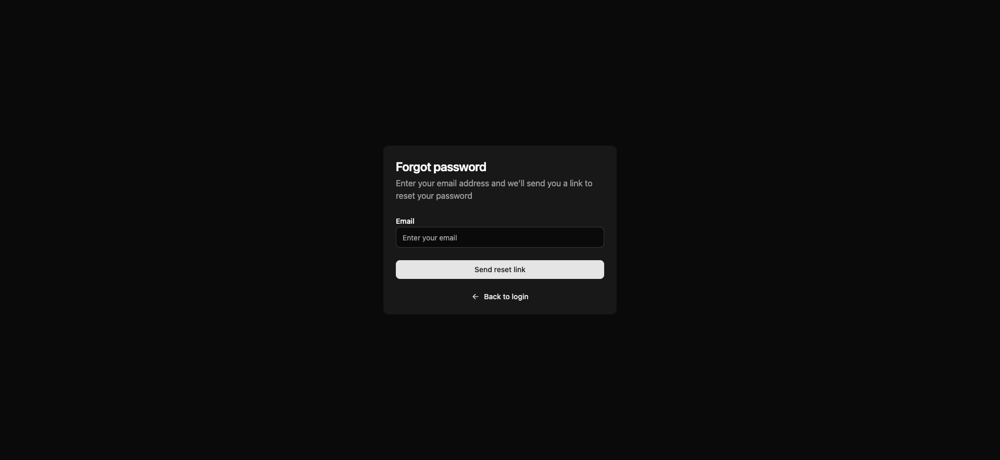

</div>

## Requirements

Before you begin, ensure you have the following installed on your system:

- **PHP** >= 7.4.0 (PHP 8.0+ recommended)
- **Composer** - PHP dependency manager ([Install Composer](https://getcomposer.org/download/))
- **Node.js** >= 18.0.0 and **npm** (or **yarn**)
- **MySQL** >= 5.7 or **MariaDB** >= 10.3
- **Web Server** (Apache/Nginx) or PHP built-in server

## Installation

### Step 1: Clone the Repository

```bash
git clone git@github.com:crenspire/yii2-react-starter.git
cd yii2-react-starter
```

Or download and extract the project archive to your desired directory.

### Step 2: Install PHP Dependencies

Install all PHP dependencies using Composer:

```bash
composer install
```

This will install all required PHP packages including Yii2 framework and Inertia.js adapter.

### Step 3: Install Node.js Dependencies

Install all frontend dependencies:

```bash
npm install
```

This will install React, Inertia.js, Shadcn UI components, Tailwind CSS, and all other frontend dependencies.

### Step 4: Configure Database

1. Create a MySQL database for your application:

```sql
CREATE DATABASE yii2basic CHARACTER SET utf8mb4 COLLATE utf8mb4_unicode_ci;
```

2. Update the database configuration in `config/db.php`:

```php
return [
    'class' => 'yii\db\Connection',
    'dsn' => 'mysql:host=localhost;dbname=yii2basic',
    'username' => 'root',
    'password' => 'your_password',
    'charset' => 'utf8mb4',
];
```

Replace `your_password` with your MySQL root password (or your database user credentials).

### Step 5: Run Database Migrations

Run the migrations to create all necessary database tables:

```bash
php yii migrate
```

This will create the following tables:
- `users` - User accounts with soft deletes
- `password_reset_tokens` - Password reset functionality
- And other required tables

### Step 6: Seed Admin User (Optional)

Create an admin user for testing:

```bash
php yii seed/admin
```

This creates an admin user with:
- **Email**: `admin@example.com`
- **Password**: `admin123`

### Step 7: Configure Cookie Validation Key

The cookie validation key should be automatically generated during `composer install`. If it wasn't, you can generate it manually:

1. Open `config/web.php`
2. Find the `cookieValidationKey` in the `request` component
3. Set it to a random string (32 characters recommended):

```php
'request' => [
    'cookieValidationKey' => 'your-random-32-character-string-here',
],
```

You can generate a random string using:

```bash
php -r "echo bin2hex(random_bytes(16));"
```

### Step 8: Start Development Servers

You need to run two servers simultaneously:

1. **PHP Development Server** (Backend):
   ```bash
   php yii serve
   ```

2. **Vite Development Server** (Frontend):
   ```bash
   npm run dev
   ```

Or use `concurrently` to run both at once (if installed):

```bash
npx concurrently "php yii serve" "npm run dev"
```

### Step 9: Access the Application

Open your browser and navigate to:

```
http://localhost:8080
```

You should see the home page. You can now:

- **Sign Up**: Create a new account at `/auth/register`
- **Sign In**: Login at `/auth/login` (or use admin credentials if you seeded)
- **Dashboard**: Access the dashboard at `/dashboard` (requires login)

## Production Build

For production deployment, build the frontend assets:

```bash
npm run build
```

This will compile and optimize all React components and assets into the `web/dist` directory.

## Configuration

### Environment Configuration

The application uses Yii2's environment configuration. You can set the environment by:

1. Copying `config/params.php` and modifying as needed
2. Setting `YII_ENV` constant in `web/index.php`:
   - `YII_ENV_DEV` - Development mode
   - `YII_ENV_PROD` - Production mode

### Additional Configuration Files

- `config/web.php` - Web application configuration
- `config/console.php` - Console application configuration
- `config/db.php` - Database configuration
- `config/params.php` - Application parameters

**NOTES:**
- Make sure the `runtime/` and `web/assets/` directories are writable by the web server
- For production, disable debug mode and enable schema caching in `config/web.php`
- Configure your web server to point to the `web/` directory as the document root

## Directory Structure

```
assets/             contains assets definition
commands/           contains console commands (controllers)
config/             contains application configurations
controllers/        contains Web controller classes
mail/               contains view files for e-mails
models/             contains model classes
migrations/         contains database migrations
resources/          contains frontend resources (React, CSS, JS)
  js/               React components and pages
  css/              Stylesheets
runtime/            contains files generated during runtime
tests/              contains various tests for the basic application
vendor/             contains dependent 3rd-party packages
views/              contains view files for the Web application
web/                contains the entry script and Web resources
  images/           contains screenshots and images
  dist/             contains built frontend assets (production)
```

## Testing

Tests are located in `tests` directory. They are developed with [Codeception PHP Testing Framework](https://codeception.com/).
By default, there are 3 test suites:

- `unit`
- `functional`
- `acceptance`

Tests can be executed by running

```
vendor/bin/codecept run
```

The command above will execute unit and functional tests. Unit tests are testing the system components, while functional
tests are for testing user interaction. Acceptance tests are disabled by default as they require additional setup since
they perform testing in real browser. 


### Running  acceptance tests

To execute acceptance tests do the following:  

1. Rename `tests/acceptance.suite.yml.example` to `tests/acceptance.suite.yml` to enable suite configuration

2. Replace `codeception/base` package in `composer.json` with `codeception/codeception` to install full-featured
   version of Codeception

3. Update dependencies with Composer 

    ```
    composer update  
    ```

4. Download [Selenium Server](https://www.seleniumhq.org/download/) and launch it:

    ```
    java -jar ~/selenium-server-standalone-x.xx.x.jar
    ```

    In case of using Selenium Server 3.0 with Firefox browser since v48 or Google Chrome since v53 you must download [GeckoDriver](https://github.com/mozilla/geckodriver/releases) or [ChromeDriver](https://sites.google.com/a/chromium.org/chromedriver/downloads) and launch Selenium with it:

    ```
    # for Firefox
    java -jar -Dwebdriver.gecko.driver=~/geckodriver ~/selenium-server-standalone-3.xx.x.jar
    
    # for Google Chrome
    java -jar -Dwebdriver.chrome.driver=~/chromedriver ~/selenium-server-standalone-3.xx.x.jar
    ``` 
    
    As an alternative way you can use already configured Docker container with older versions of Selenium and Firefox:
    
    ```
    docker run --net=host selenium/standalone-firefox:2.53.0
    ```

5. (Optional) Create `yii2basic_test` database and update it by applying migrations if you have them.

   ```
   tests/bin/yii migrate
   ```

   The database configuration can be found at `config/test_db.php`.


6. Start web server:

    ```
    tests/bin/yii serve
    ```

7. Now you can run all available tests

   ```
   # run all available tests
   vendor/bin/codecept run

   # run acceptance tests
   vendor/bin/codecept run acceptance

   # run only unit and functional tests
   vendor/bin/codecept run unit,functional
   ```

### Code coverage support

By default, code coverage is disabled in `codeception.yml` configuration file, you should uncomment needed rows to be able
to collect code coverage. You can run your tests and collect coverage with the following command:

```
#collect coverage for all tests
vendor/bin/codecept run --coverage --coverage-html --coverage-xml

#collect coverage only for unit tests
vendor/bin/codecept run unit --coverage --coverage-html --coverage-xml

#collect coverage for unit and functional tests
vendor/bin/codecept run functional,unit --coverage --coverage-html --coverage-xml
```

You can see code coverage output under the `tests/_output` directory.
